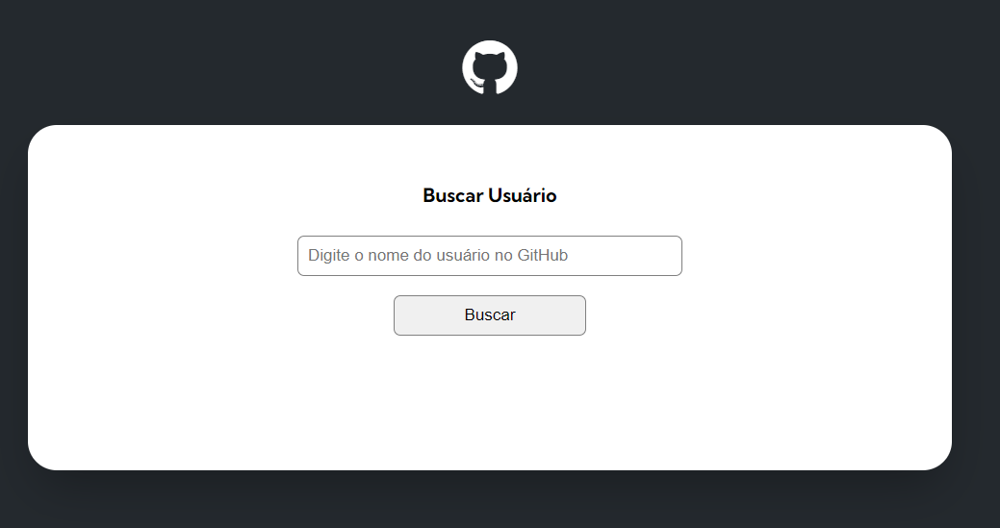

# GitHub-API

Este é um projeto de busca de usuários usando a API do GitHub

## Sumário

- [Visão Geral](#visão-geral)
  - [Print](#print)
  - [Links](#links)
- [Meu processo](#meu-processo)
  - [Tecnologias](#tecnologias)
  - [Pratica de Aprendizado](#pratica-de-aprendizado)
  - [Habilidades em Desenvolvimento](#habilidades-em-desenvolvimento)
- [Autor](#autor)
- [Agradecimentos](#agradecimentos)

## Visão Geral

### Print



### Links

- Solução: [Ir para solução](https://vinicius-b-oliveira.github.io/github-api/)

## Meu Processo

### Tecnologias

- Marcação semantica com HTML 5
- Folhas de estilo em cascata no CSS 3
- Estilos flexiveis usando CSS Flexbox
- Git para versionamento de código
- Uso de API com JavaScript

### Pratica de Aprendizado

Esse projeto me proporcionou um avanço no entendimento do funcionamento das APIs e do próprio JavaScript. 

Segue abaixo um trecho de código com os conhecimentos relatados acima: 

```javascript

import { baseUrl } from "../variables.js"

async function getUser(userName) {
    const response = await fetch(`${baseUrl}/${userName}`)
    return await response.json()
}

export { getUser }

```

## Autor

- Github - [Vinicíus Bueno](https://github.com/Vinicius-b-oliveira)

## Agradecimentos

Projeto realizado durante o curso de programação [Dev Quest](https://devemdobro.com/matriculas-abertas/) sobre mentoria dos gêmeos Ricardo Dias e Roberto Dias. 